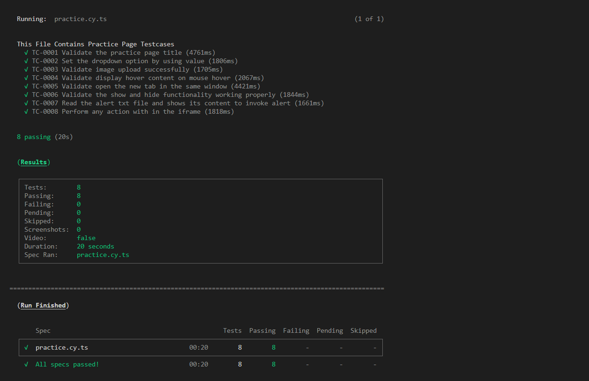
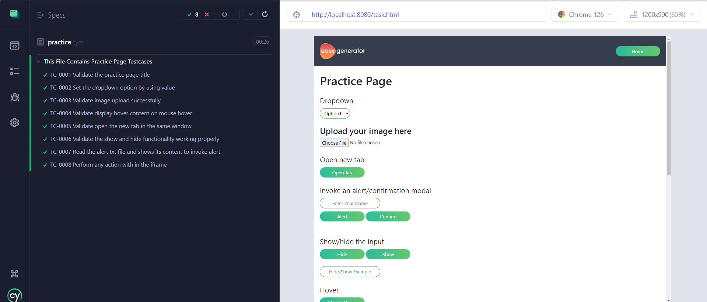

# shariq-easygenerator-ts

Technical Assessment For EasyGenerator

## Project Structure
The project structure is organized as follows:

- The cypress directory contains the source code, including page objects, locators, test resources, and test case file files.
- The cypress/fixtures/images/ directory holds the images/resources that are using in the test cases.
- The cypress/e2e/tests/ directory contain the test case file where we can create different test cases file to test the different features/functionality.
- The cypress/support/locators directory has all the locators file that are using the page objects files.
- The cypress/support/pageObjects directory contains all the page files where we can used the locators and perform some repeatative actions.


## Getting Started
To get started with the project, follow these steps:

Clone this repository to your local machine by using below command.

```bash
git clone https://github.com/ShariqNaeem/shariq-easygenerator-ts.git
```

Now install the required dependencies 

```bash
npm i
```

## Running the Application

To start the application server:

```bash
npm start
```

### Formatting Code

To check if code is formatted correctly:

```bash
npm run format:check
```

To automatically format code:

```bash
npm run format:write
```

### Running Tests

To run tests in headless mode:

```bash
npm run run:test:headless
```

To open Cypress Test Runner:

```bash
npm run open:cypress-runner
```

### Results

After running the test cases on the headless, you will get the test cases details in the terminal/console


After running the test cases on the cypress dashboard runner, you will see the results in the cypress dashboard
